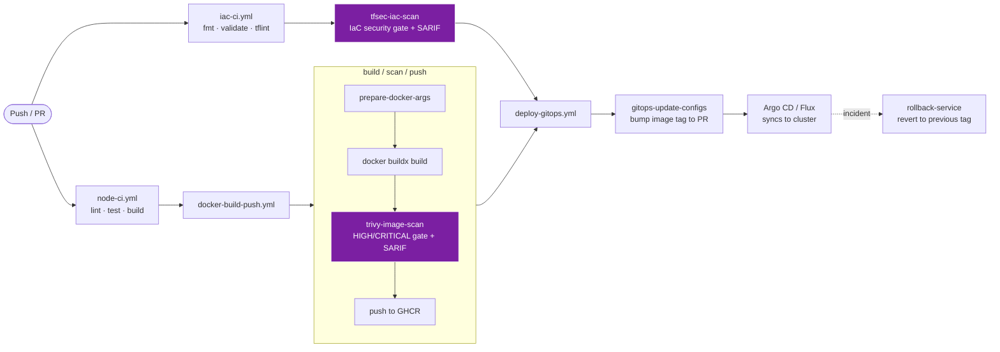

# reusable-github-actions


-EF7B4D?style=flat-square&logo=argo&logoColor=white)


> A central library of **reusable GitHub Actions workflows + composite actions** that gives every application repo a complete, standardized **CI → build/scan/push → GitOps deploy** pipeline with almost no copy-pasted YAML. Define the pipeline once, consume it everywhere with a single `uses:` line.

---

## 🔁 Pipeline Flow



🛡️ = security gate. **`tfsec`** scans the IaC and **`Trivy`** scans the image — both fail the build and upload SARIF to code scanning.

> 🛡️ **Two security gates, both fail-the-build and upload SARIF to code scanning:** `tfsec` scans the **IaC** before it ships, and `Trivy` scans the **image** before it is pushed.

---

## ✨ Features

- **Reusable workflows** (`workflow_call`) — consume with `uses: acme/reusable-github-actions/.github/workflows/<file>@v1`.
- **Composite actions** — small, single-purpose, independently testable building blocks.
- **Security-gated, shift-left** — **tfsec** scans IaC and **Trivy** scans every image; the push/merge only happens **after** the scan passes, and both upload results to GitHub code scanning (SARIF).
- **Pull-based CD** — deploys by bumping image tags in a GitOps repo and opening a PR; Argo CD / Flux does the actual rollout.
- **Fast, reversible** — immutable `sha-` tags, GHA build cache, and a one-shot **rollback** action that reverts to the previous tag.
- **DRY at org scale** — one change here propagates to every consuming repo (pin to `@v1` and move the tag for controlled rollouts).

---

## 🗂️ Repository Structure

```
.github/
├── workflows/                     # reusable workflows (workflow_call)
│   ├── docker-build-push.yml      # build → trivy scan gate → push to GHCR
│   ├── node-ci.yml                # lint · test · build (Node.js / Next.js)
│   ├── iac-ci.yml                 # terraform fmt/validate/tflint → tfsec gate
│   ├── deploy-gitops.yml          # bump GitOps config + open PR (approval-gated)
│   └── ci.yml                     # self-test: actionlint + yamllint
└── actions/                       # composite actions (reusable steps)
    ├── prepare-docker-args/       # tags, OCI labels, cache args
    ├── trivy-image-scan/          # image CVE scan + SARIF upload + fail gate
    ├── tfsec-iac-scan/            # Terraform/IaC security scan + SARIF + gate
    ├── gitops-update-configs/     # yq bump image tag → PR
    └── rollback-service/          # revert to previous image tag
examples/
└── caller-workflow.yml            # how a downstream app repo consumes these
```

## 🚀 Usage

In any application repo, `.github/workflows/release.yml`:

```yaml
jobs:
  ci:
    uses: acme/reusable-github-actions/.github/workflows/node-ci.yml@v1
    with: { node-version: "20" }

  image:
    needs: ci
    uses: acme/reusable-github-actions/.github/workflows/docker-build-push.yml@v1
    with: { image-name: acme/checkout-svc, push: true }

  deploy:
    needs: image
    uses: acme/reusable-github-actions/.github/workflows/deploy-gitops.yml@v1
    with:
      service: checkout-svc
      environment: staging
      image-tag: ${{ needs.image.outputs.image }}
      gitops-repo: acme/gitops-config
    secrets:
      gitops-token: ${{ secrets.GITOPS_APP_TOKEN }}
```

See [`examples/caller-workflow.yml`](examples/caller-workflow.yml) for the full pipeline.

## 🔐 Security

- Least-privilege `permissions:` per workflow (e.g. `packages: write` + `security-events: write` only where needed).
- Secrets passed explicitly via `secrets:` inputs — never hard-coded. GitOps writes use a scoped **GitHub App token**, not a personal PAT.
- **tfsec** gate blocks insecure Terraform/IaC from merging; **Trivy** gate blocks images with fixable HIGH/CRITICAL CVEs from ever being pushed.
- Third-party actions are version-pinned.

## 🧭 Engineering Case Study

**Context.** Dozens of microservice repos each carried their own near-identical CI/CD YAML — drift, inconsistent security scanning, and slow org-wide changes.

**Approach.** Built a **single reusable-actions repository**: reusable `workflow_call` workflows for CI, image build/scan/push, and GitOps deploys, composed from small **composite actions**. Standardized a Trivy security gate, immutable image tagging, GHA caching, and pull-based CD (PR into a GitOps repo, synced by Argo CD), plus a one-command rollback.

**Impact.** New services get a production-grade pipeline by adding a few `uses:` lines; security scanning is enforced uniformly; and a pipeline change ships to every repo by moving one version tag — eliminating copy-paste drift across the org.

> Generic reference implementation — no employer/client names, secrets, or internal identifiers. All names (`acme`, `checkout-svc`) are placeholders.

## 📄 License

[MIT](LICENSE) © Muhammad Imad
